# Arduino-Summer-Camp
In the summer of 2023, I conducted a summer camp to teach students programming and electronics using Arduino and simple components. The camp focused on making real world applications like a five Key Piano, Automatic Piano, Metronome, Weather Station, Range Finder, Collison Alert and Water Overflow Detection systems using a micro controller board (Arduino Uno R3 in our case), sensors like Ultrasonic Sensor, Water Sensor, Potentiometer, and Temperature and Humidity and audio visual actuators or output devices like LEDs, Piezo Buzzer and OLED Display.

I designed the curriculum for middle to high schoolers with no prior experience in coding or electronics. I selected the components, designed a kit, developed lesson plans and conudcted the camp at Casa de Amistad in San Diego. The students were very engaged and had a fun learning and enriching experience.

This repostory contains the Code and Explanation for the projects. 

Learn more about each project on my [youtube channel](https://www.youtube.com/channel/UCszrNeQ_xBV6YQfvcIs6uVA).

## 1. Inventory

| S.No. | Part  | Image  | Vendor        | Quantity |
|:-----:|:-----:|:------:|:-------------:|:----:|
| 1.    | Aruino Uno R3 | 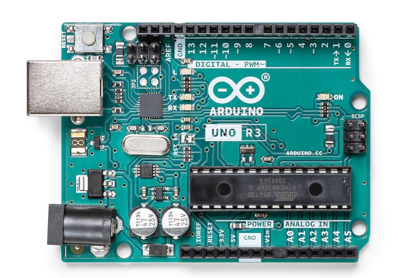 | RobotShop | 1 | 
| 2.    | Grove Base Shield |  | Seeed Studio | 1 | 
| 3.    | Acrylic 8''x10'' sheet |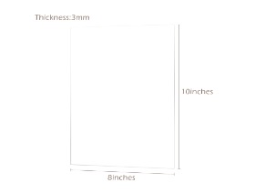 | Amazon | 1 | 
| 4.    | Acrylic 3.5''x2'' panel |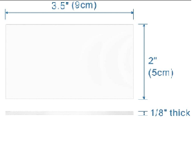 | Amazon | 1 | 
| 5.    | Vinyl Sticker Paper |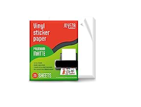| Amazon | | 
| 6.    | Mini Lamp & Holder|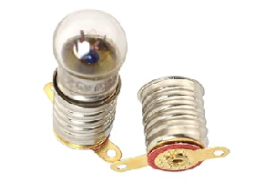| Amazon | | 
| 7.    | 3V AA Battery Holder with Knife Switch |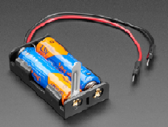| Adafruit | | 
| 8.    | Grove Yellow Blue OLED Display |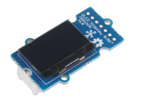 | Amazon | |
| 9.    | Grove LED | 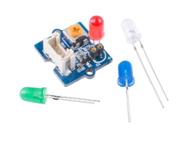 | Amazon | |
| 10.    | Grove Buzzer | 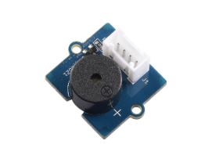  | Amazon | |
| 11.   | Grove Rotary Sensor | 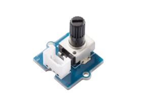 | Amazon | |
| 12.   | Grove Temperature & Humidity Sensor |  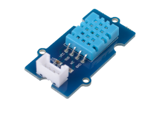 | Amazon | |
| 13.   | Grove Ultrasonic Sensor |  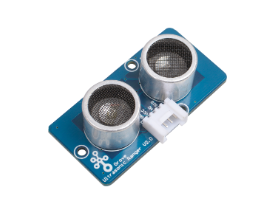 | Amazon | |
| 14    | Grove Water Sensor | 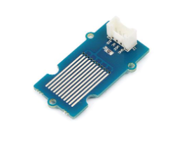  | Amazon | |
| 15.   | Gikfun Buttons | 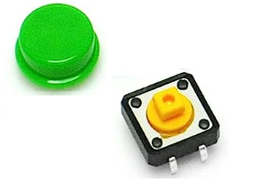 | Amazon | |
| 16.   | L Brackets | 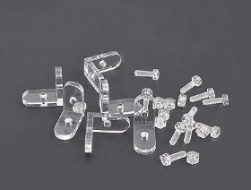 | Amazon | |
| 17.   | Small Funnel | 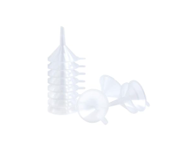 | Amazon | |
| 18.   | IR Receiver | 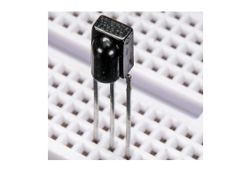 | Adafruit | |
| 19.   | JUmper Cables | 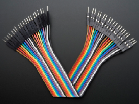 | Amazon | |
| 20.   | 10k Ohm Resistors | 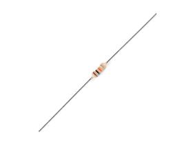 | RobotShop | |
| 21.   | 330 Ohm Resistors | 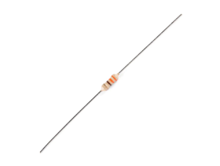 | RobotShop | |

Notes:
1. The Grove components came with the Grove Cables (4 wire cable - red for vcc, black for ground, yellow for signal, white for signal or no connection).
2. An inkject Epson printer was used for printing on the Vinyl Stickers to scale at 200 dpi
3. Fiskars cutting tool was used to cut the printed vinyl sticker precisely
4. A drill with 2mm, 2.4mm and 2.9mm drill bits was used to make holes in the Acrylic
5. A soldering iron was used to make slots and holes in the platic water reservoir
6. All components were collated in a plastic container to hand to each student

## 1. Board Creation
It was important to have all components assembled together so students had an organized workspace and could appreciate what is involved in making real applications and not just a quick demo. For this, I designed a layout in python (Arduino Project Layout.py) of a 8x10 inchees acrylic board. It was printed on vinyl sticker and then pasted on acrylic sheets.

Below are images of a printed layout. This allowed easy drilling of holes. A 3.5in x 2.5 in acrylic panel was used for the installing the Ultrasonic Sensor.

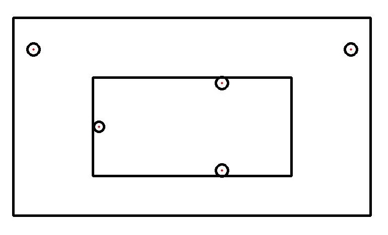 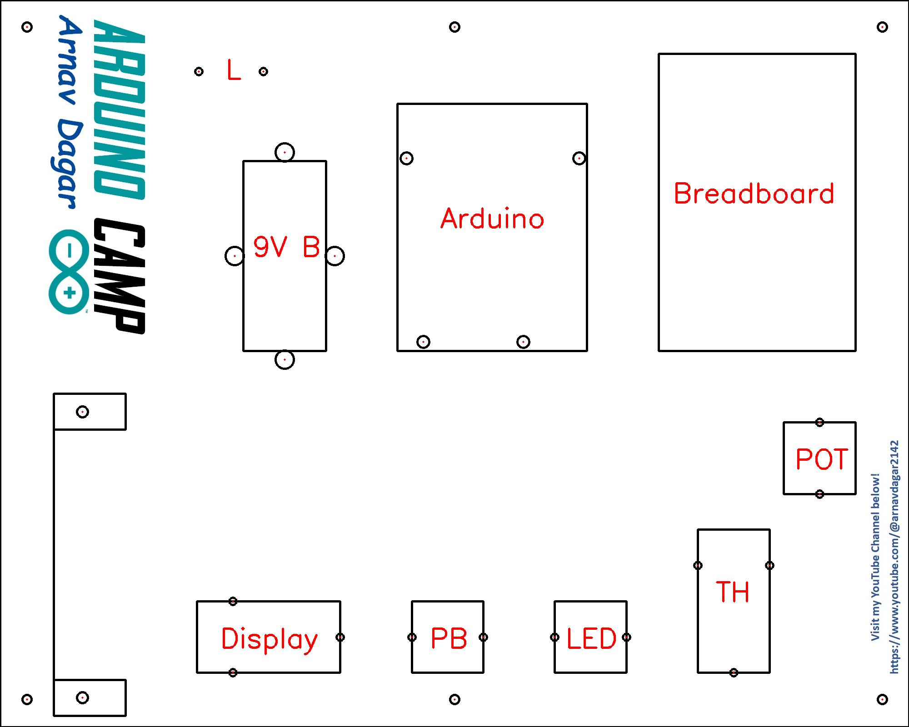 

The Acrylic Board housed all the componenets:
* Arduino Uno R3
* Grove Base Shield
* Breadboard
* Lamp
* 9V Battery
* Grove Potentiometer
* Grove Temperature & Humidity Sensor (DHT11)
* Grove LED
* Grove Buzzer
* Grove OLED Display
* Grove Ultrasonic Ranger
* Grove Water Sensor

The Aruino Uno R3 is attached to the board using M2.5+6 5mm standoffs and M2.5 screws and nuts. The breadboard is pasted on the board. 

The water sensor was installed on a plastic water reservoir. Using a soldering iron on a plastic box with lid, I cut out a slot for water sensor and a hole for a funnel to add water. 

Ultrasonic sensor was installled on the small panel using M2.5+6 5mm standoffs, screws and nuts. This small pannel was connected to the mainboard using L shaped brackets with M3 screws and nuts.

Other sensors (POT, DHT11 sensors) were connected using M2+6 5mm standoffs and screws.  The actuators (OLED display, LED, Buzzer) were connected using M2+6 10mm standoffs. The acrylic board used a stand made from M2.5+6 25mm standoffs and nuts.

The majority of these parts are attached to the board via standoffs, screws, and nuts. I drilled holes onto the acrylic board based on an outline I created from a python script. The Water Sensor, Breadboard, and 9V Battery are the only parts not connected via standoffs. The Ultrasonic Ranger is attached using a seperate acrylic board installed perpendicular to make it easier for the students to test out said sensor. 

## 2. Basic Circuits
I started the camp by teaching the students circuit basics starting with a lamp, battery and switch.
Then we went through how to use a breadboard to assemnle circuits
* Turning ON and LED on the Breadboard
* Using a potentiometer to change the brightness of the LED
* Using a button to turn the LED ON and OFF

We also installed the Lamp. We used a 3V battery holder with switch to turn the Lamp on and off.

Learn more about these basics in [this video](https://www.youtube.com/watch?v=bQS-vkHR7F8&)

## 3. Basic Circuits with Arduino
We started with a discussion of how the Arduino works and the parts of the Arduino such as the ATMega 328P Chip, Digital Headers, Analog Headerrs, Power Headers, USB Socket, Power Jack, the Printed Circuit Board (PCB) and more. 

After installing the Arduino IDE, we looked at basic Arduino ciruits and small programs for sensors and actuators.

I also provided an [Arduino Function Cheatsheet](https://docs.google.com/document/d/1QYzo4wBym-xJpfdnLt6h2N2m4J6qdlCz4fPCTWNhXuQ/edit?usp=sharing) to help the students out with programming.

### a). Blink
The students created a program to blink the LED ON and OFF. The students learned about the following functions:
* setup(): Called when the program first starts. “Setup” variables, pin modes, libraries, etc. This function only runs once.
* loop(): Occurs after setup function. Code inside here will run forever.
* pinMode(pin, mode): Used to specify if the pin is an INPUT or OUTPUT (for example, we take __input__ from a potentiometer, but send __outputs__ to an LED).
* digitalWrite(pin, value): Writes a HIGH or LOW value to a digital pin.
* delay(ms): Wait for amount of milliseconds specified (Note: tone function runs concurrently).

### b). POT
The students learned how to control and LED using a Potentiometer. T he students learned about the following new functions:
* analogRead(pin): Read the value of analog pin (A0, A1, etc.). Value will be from 0-1023
* analogWrite(pin, value): Writes an analog value to a pin. This value should be between 0 and 255.

We also discussed PWM Pins. Learn more about PWM Pins in [this video](https://www.youtube.com/watch?v=s4Tgw_W7Zdg).

### c). Button
The students used a Button with a pull up resistor to turn an LED ON and OFF. 

## 2. Grove Base Shield and Grove Components

A Grove Base Shield and Grove Components were used for the rest of the camp. This ensured faster, error free circuit assembly to allow the students to focus on applications and programming.

The Grove Shield is mounted on top of the Arduino UNO R3 and Grove components are connected to the shield through Digitial, Analog and I2C ports through a 4 wire Grove Cable. There is no need to worry about power, ground, pull up resistors etc.

The Grove Shield is pictured below along with an Arduino UNO R3 Board.

 

Below picture shows the different components. The Grove components are connected to the Grove Shield. The Grove Shield also exposes the Arduino Headers allowing the buttons to be connected in a traditional manner on a breadboard.

### a). Actuators or Output Devices:
The micro-controller uses these to initiate specific actions e.g. display something, alter the state of LED or emit a tone.

### b). Sensors or Input Devices:
The micro controller uses these to gets inputs from the user or environment e.g. POT angle,  temperature, humidity, level sensor is submerged in water and distance to an obstacle. Based on these inputs, the micro controller can be programmed to send outputs to actuators.

### c) Circuit Diagram for all the components

The circuit diagram shows how the various components are connected. The Buttons and IR receiver are connected using the Header Pins of the Grove Shield on the breadboard and the corresponding PINs are shown.

The Grove components are connected to the Grove Shield Ports which are shown in the circuit diagram:

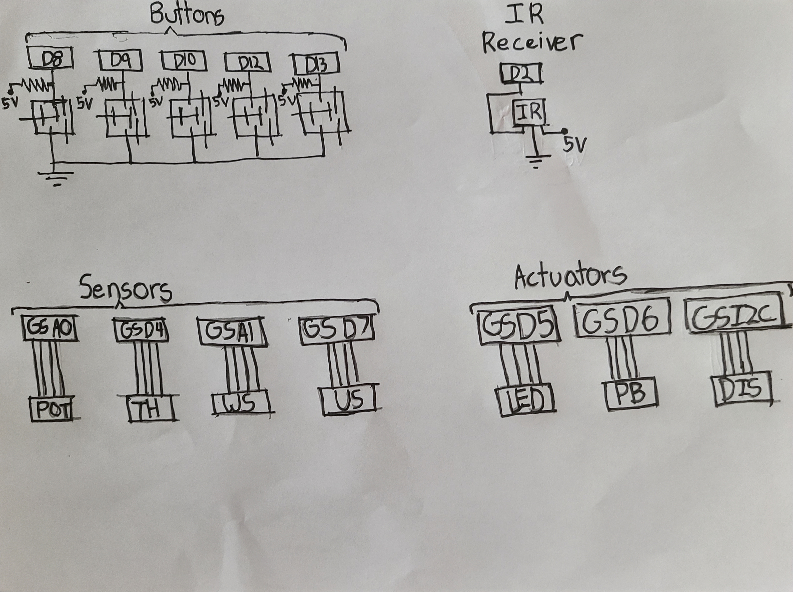 

## 5. Piano
The following projects were used to teach the students how to use a buzzer to emit specific tones similar to a piano in different projects.

### a). Five Key Piano
In this project, the students created a mini, portable piano. The following components were used in the project:
* 5 Buttons: Connected on the breadboard, each button will represent a key on the piano, ranging from Middle C (256 Hz frequency) to G (~392 Hz frequency)
* Buzzer: Will be used to emit toness of said frequencies

Learn more about this project in [this video](https://www.youtube.com/watch?v=8YZ9XIKRaRU&).

### b). Auto Piano
In this project, the students set up their board such that it played can play of tune (in this case, "Twinkle Twinkle Little Stars"). The components we use are:
* Buzzer: Will emit the frequencies that represent notes from Middle C to A
* Potentiometer: The students will use this to change the tempo (more on that in the next section) of the piece
* OLED Display: Will display the tempo selected of the piece

Note: Changing the tempo in the middle of the piece will automatically restart the piece.

Learn more about this project in [this video](https://www.youtube.com/watch?v=-I5X-YtkoWw&).

## 6. Metronome
In this project, the students created a metronome. A metronome is used in musical practice as a way to keep the beat, or tempo. An image of a metronome is shown below.

The dial shown on this metronome can be used to change the tempo, the numbers at the edge of the dial. The unit of the tempo is BPM, or beats per minute. For example, 60 BPM, means that the metronome will beep and blink 60 times a minute, or once a second.

The students will use the following components to create the metronome:
* Buzzer: Will be used to emit the beep
* LED: Will be used to blink in sync with with the beep
* OLED: WIll be used to display the BPM
* Potentiometer: WIll be used to change the tempo of the metronome

We created this metronome to mimic the one in the image: therefore the BPM will range from 40 BPM to 208 BPM.

Learn more about this project in [this video](https://www.youtube.com/watch?v=qt-YgZJz8uY).

## 7. Ultrasonic Ranger Projects
The following 2 projects were created using the Ultrasonic Ranger. The Ultrasonic Ranger can return a distance in centimeters or inches, and we can do different things with this information.

### a). Range Finder
A range finder is commonly used in golf to determine how far away the hole is. This helps one determine which club to use. The students created a simple range finder using the following parts:
* Ultrasonic Ranger: Returned distance to nearest obstacle
* OLED Display: Prints out this value

Learn more about this project in [this video](https://www.youtube.com/watch?v=FXLg-NOD_yA).

### b). Collision Alert
Modern cars have different ways to detect if the car is approaching an obstacle. We will be implmeneting a simple Collision Alert in this program using the Ultrasonic Sensor. We will use the following parts:
* Ultrasonic Ranger: Returns distance to nearest obstacle
* OLED Display: Displays an alert: Clear, Caution, Danger, Critical
* Buzzer: Beeps at certain BPM depending on alert and distance
* LED: Blinks at certain speed depending on alert and distance

Learn more about this project in [this video](https://www.youtube.com/watch?v=lpBptqLrOXk).

## 8. Weather Station
We will use the following components:
* Grove Temperature and Humidity Sensor: Will read out the temperature and humidity using the DHT 11 Sensor installed
* OLED Display: Will print out the temperature and humidity given from the TH Sensor
This acts as a simple thermostat - there many different applications to this! Notice how after runnign this code, putting your finger on the sensor will increase the temperature and humidity.

Learn more about this project in [this video](https://www.youtube.com/watch?v=xR2um3CB-e0&).

## 9. Water Overflow Detector
Our final propject before we put everything together will be a Water Overflow Detector. For this project, I devised a container with a lid (pictured below) such that the Water Sensor can easily fit in the slot, and a funnel can be placed in the circular hole to increase the water level. 

The components used in this project are as follow:
* Watter Sensor: Returns the level of water touching the sensor
* OLED Display: Displays either Clear, Caution, Danger, or Critical
* Buzzer: Beeps at different frequencies depending on the water level
* LED: Blinks at different frequencies depending on the water level

Learn more about this project in [this video](https://www.youtube.com/watch?v=SfWMD1pfpyw&).

The Grove Water Sensor and the container used for testing are pictured below.

## 10. Final Project 
In the final project, the students combined all the previous project code into one final script. This was implemented such that even if the students do not have access to the code in the future, they can still run all their projects on the boards, since the Arduino will automatically run the last project that was loaded onto the Arduino once connected to power (hence why we initally installed the 9V battery on the board, allowing the students to power on the Arduino whenever they wish). 

This project cycles through each of the projects one at a time when the user presses the red and black buttons simulatenously. This was a good project to learn switch case constructs.

Learn more about this project in [this video](https://www.youtube.com/watch?v=z6CdSy7QxXw&).
